[中文](./readme_zh.md) [English](./readme.md)

Challenge attachment download link (maybe will not work in future):

[deepinreal](https://share.weiyun.com/5JMqJdT) (weiyun)

[deepinreal](https://pan.baidu.com/s/1O-A-lbRRADLYqK0y9UDX-w) (baiduyun)

[deepinreal](https://drive.google.com/drive/folders/1qrSPaE1V39a4W3yP8lXHfXAX_SuOIbYk) (google drive)

[deepinreal](https://mega.nz/#F!SiInRaKA!SBtuAQrevLcjO823h1tnPg) (mega)

[deepinreal](http://222.85.25.40/deepinreal/) (mycloud)

# DeepInReal WriteUp

Extract the `zip` file with `z01` file, we got three files.

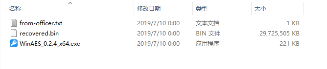

We have a look at `from-officer.txt`。


According to the `officer`'s message, we can search for the most common and weak password in the world.

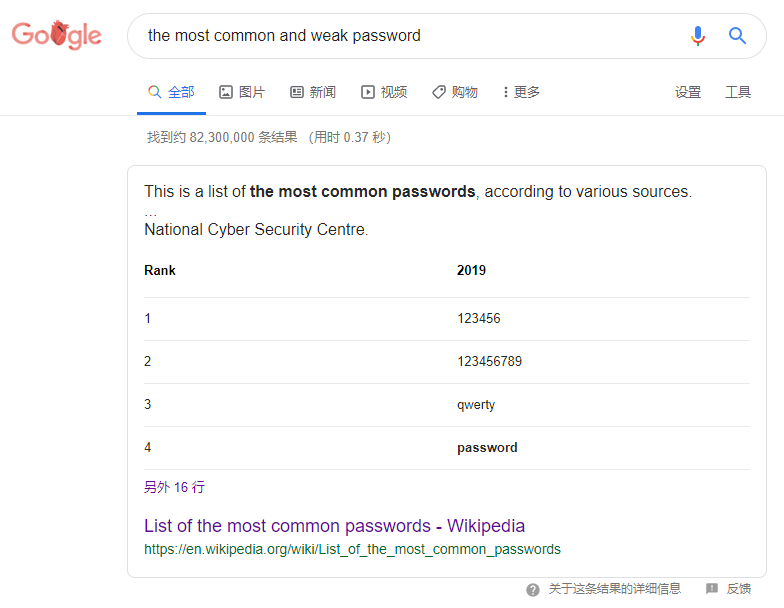

According to `wikipedia`, the first result is `123456` in 2019.

So we use `WinAES` to decrypt the `recovered.bin` file.

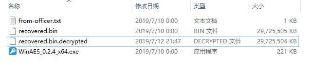

We got the decrypted file named `recovered.bin.decrypted`. And we have a look at the file's header.

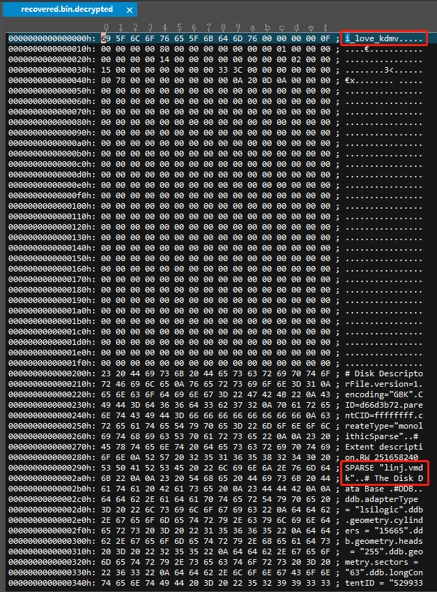

The original file name is `linj.vmdk`, it's a `vmdk` file.

The file's header had been modified. We can modify it back to normal.

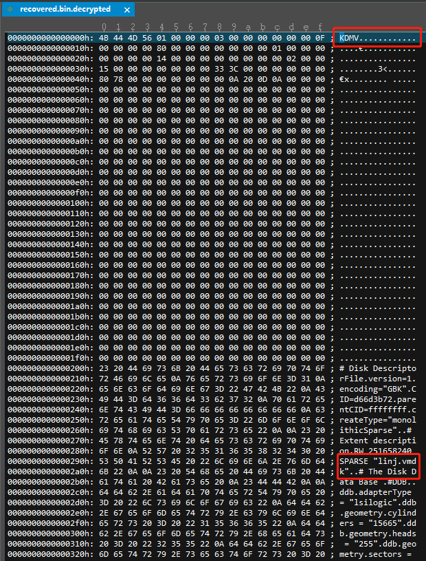

We attach the vmdk file in vmware and boot it.

We need password to login the system. The password hint is `headers`.

So `i_love_kdmv` is the password.


When we logined, there is a sticker paper on the desktop.

According to the hint, we press `win+x` to open `windows ink` panel.


We can see `bitlock` on the `sketchpad`. We click into the `sketchpad`.

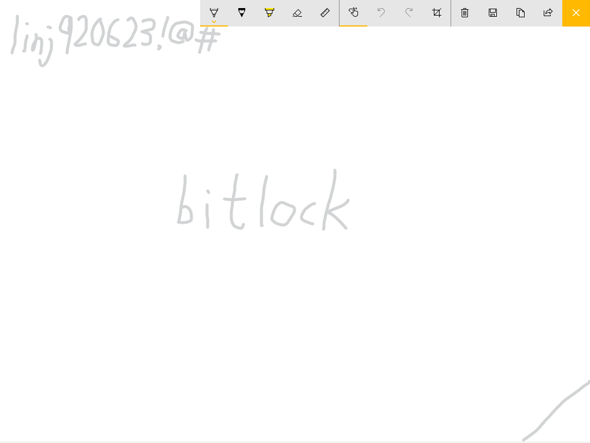

Here is our bitlock password `linj920623!@#`.

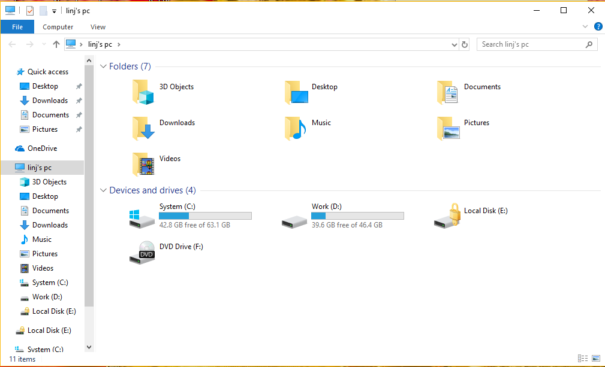

We decrypt the bitlocker disk.

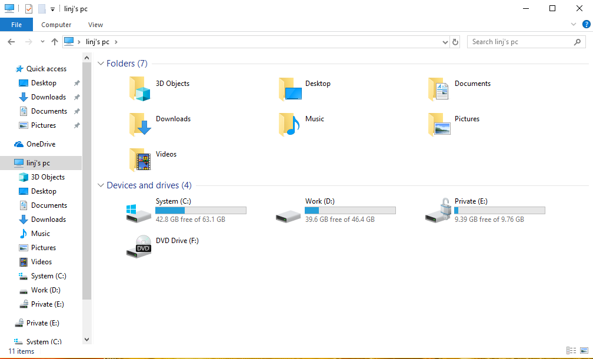

There are two files we should focus on.

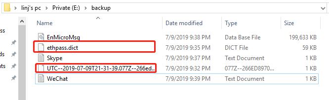

A ethereum wallet file and a password dictionary.

We try to write a script to brute it.

```
import eth_keyfile
import json

fp = open('ethpass.dict', 'r')
wallet = json.loads(open('UTC--2019-07-09T21-31-39.077Z--266ed8970d4713e8f2701cbe137bda2711b78d57', 'r').read())

while True:
    try:
        password = fp.readline().strip().encode('ascii')
        if len(password) <= 0 :
            print("password not found")
            break
    except:
        continue
    try:
        result = eth_keyfile.decode_keyfile_json(wallet, password)
    except:
        continue
    print(password)
    print(result)
    break
```

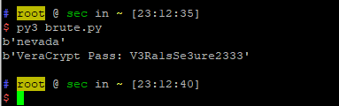

We got the result. Password: `nevada`. Private key: `VeraCrypt Pass: V3Ra1sSe3ure2333`.

We find the VeraCrypt file in forensic software.

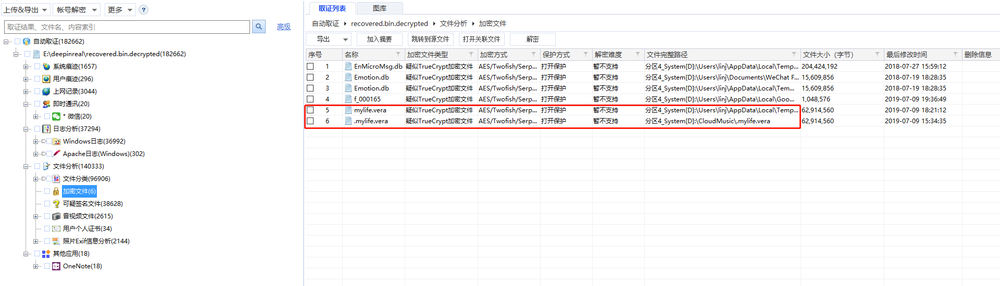

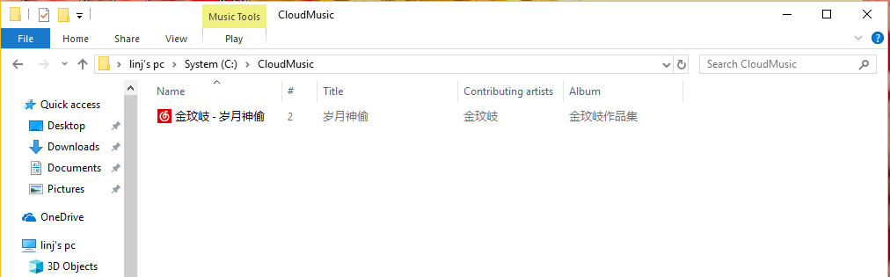

But we could not find the file in vmware's vm.

We find a `.mylife.vera` delete script in boot folder.

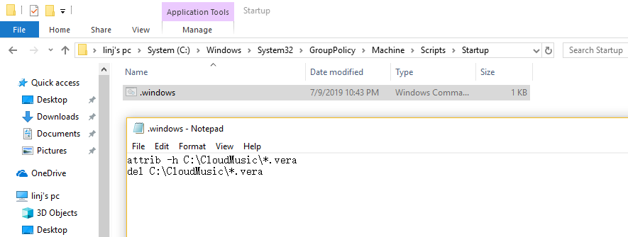

So we can dump the file in some ways.

Use the password to decrypt the `.vera` file and mount it.

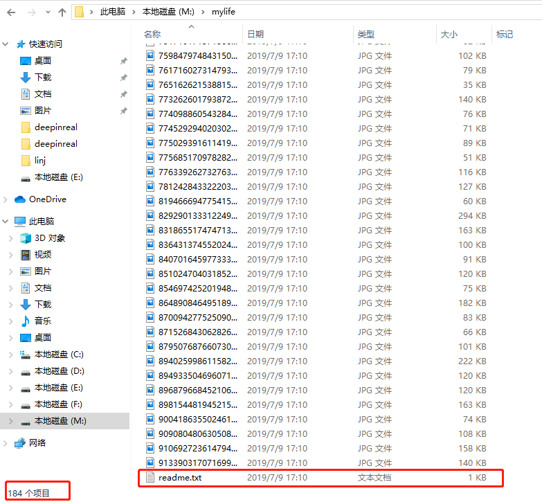

We can find `184` files in the folder.

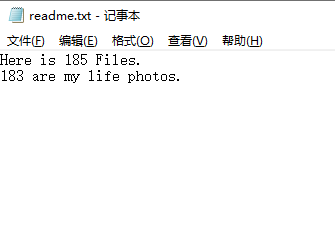

`readme` file gave us a hint 'there is `185` file in this folder'. So there is a hidden file.

The filesystem is `NTFS`. So the suspect may uses `ntfs ads` to hide the secret file.

We can use `dir /r` to find the hidden file `528274475768683480.jpg:k3y.txt:$DATA`.


Use command `notepad 528274475768683480.jpg:k3y.txt` to read the hidden file.

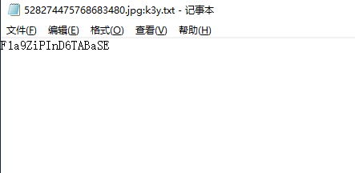

We got the password `F1a9ZiPInD6TABaSE`.

The computer had installed `phpStudy` and `Navicat`, we boot the `mysql server` and try to find the flag zip.

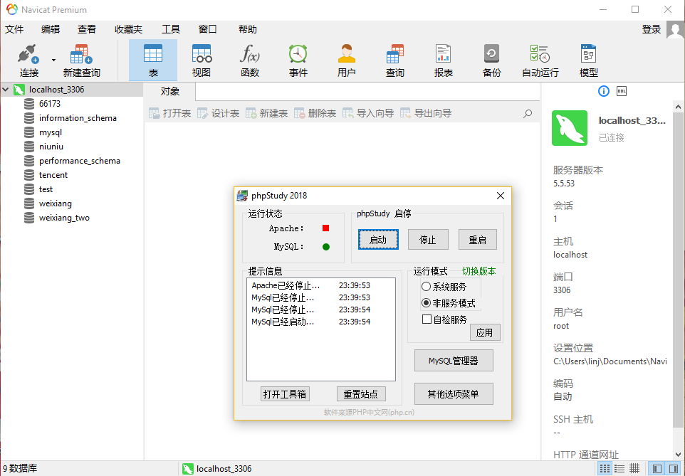

The databases' name are the same with `.sql` file name in bitlocker `gambling` folder.

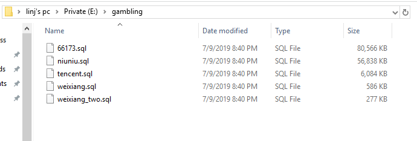

We can compare the database and find out the differences.

Database `tencent` have a extra table `auth_secret`.

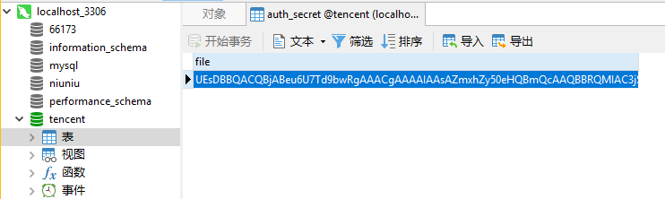

There is a `base64 encoded` flag zip inside.

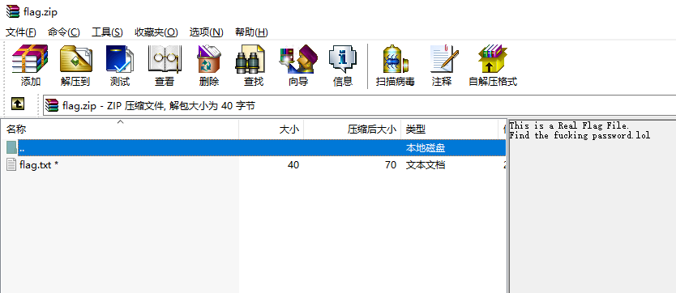

We use the password `F1a9ZiPInD6TABaSE` to decrypt the `flag.txt` file.

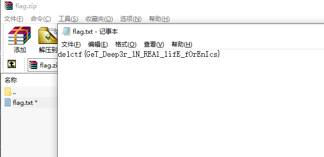

We got the flag.

Flag: `de1ctf{GeT_Deep3r_1N_REAl_lifE_fOrEnIcs}`
