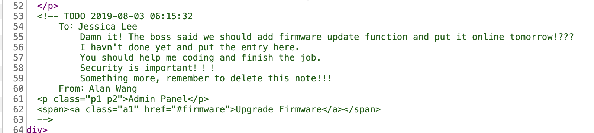
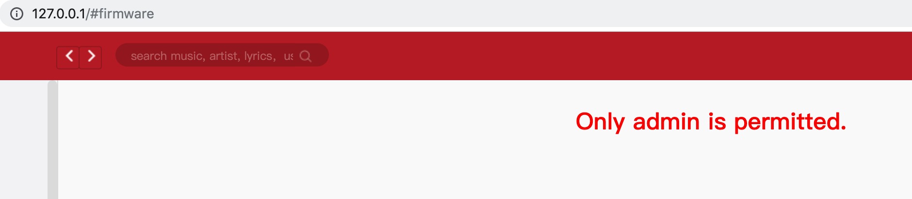
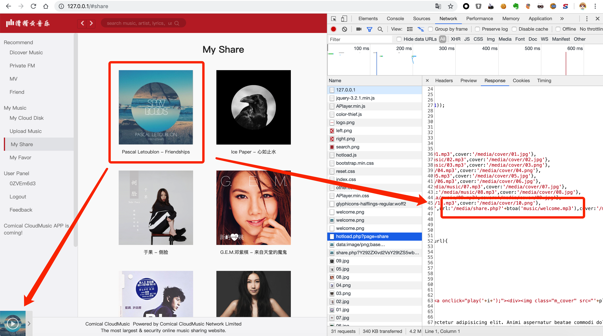
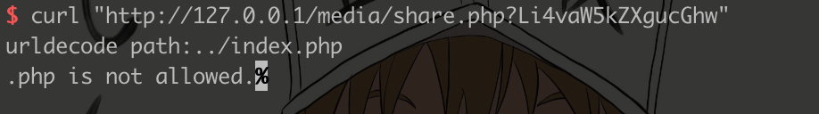
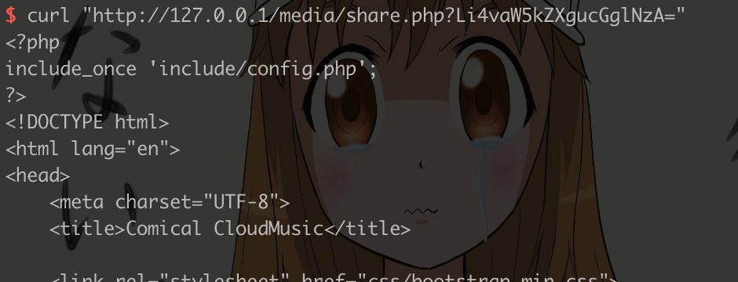
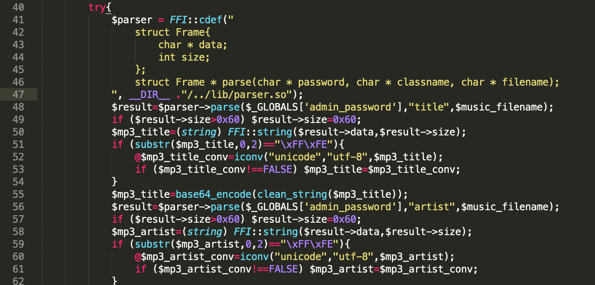
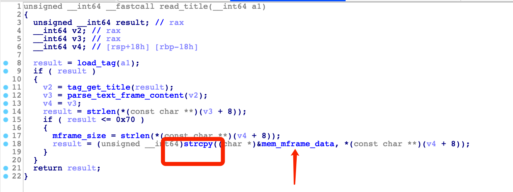
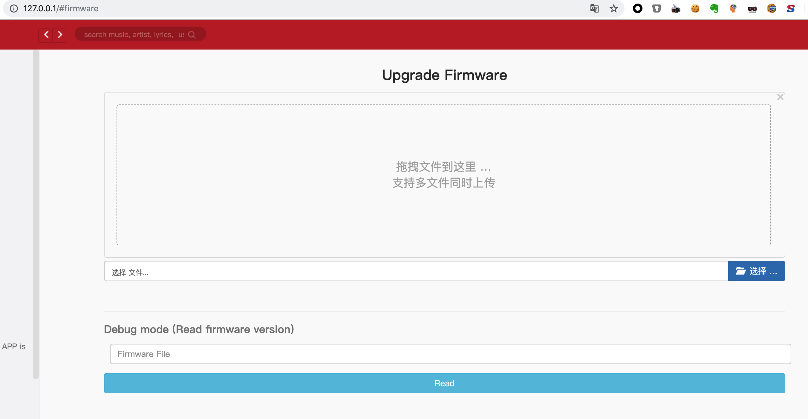
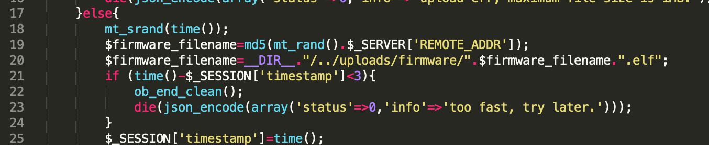
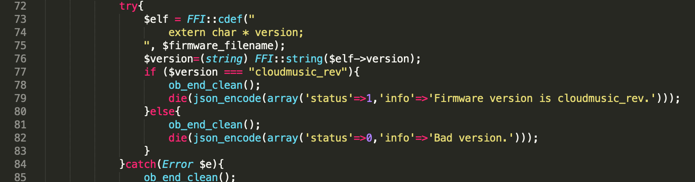

[中文](./readme_zh.md) [English](./readme.md)

[Docker](./docker) [Exp](./exp.py)

# CloudMusic_rev WriteUp

以前 1.0 版本 writeup：

[impakho/ciscn2019_final_web1](https://github.com/impakho/ciscn2019_final_web1)

本题是 2.0 版本。

先审计源代码，找到首页备注里有 `#firmware` 功能。



`#firmware` 功能需要登录，而且只有管理员有权限访问。



然后注册登录，在我的分享页面里看到一首英文歌，其它都是中文歌，而且这首英文歌在首页就已经放入到播放器列表里。

所以看分享 `#share` 页面源代码，能看到 `/media/share.php?` 后面还用 `btoa` 也就是 `base64编码`，所以这里不难发现有个任意文件读取。



尝试读取 `../index.php` 页面的源代码，访问 `http://127.0.0.1/media/share.php?Li4vaW5kZXgucGhw`。



限制了 `.php` 文件，根据提示，可以使用 `urlencode` 编码绕过。



成功读取到 `../index.php` 文件，那么其它文件也可以读取到。

然后就是读取网站目录下的文件，进行源代码审计。我们的目标就是拿到管理员密码，然后访问 `#firmware` 功能。

那么我们需要找到源代码里，哪里读取到管理员密码，这些位置并不多。这里漏洞点在 `/include/upload.php` 里，调用到 `/lib/parser.so` 进行音频文件解析，传入了管理员密码。



那么我们需要用 `IDA` 反编译 `/lib/parser.so` 文件，漏洞点在 `read_title` / `read_artist` / `read_album` 三个函数里的 `strcpy` 处，`off by null`，刚好可以覆盖到 `mem_mframe_data` 后面的 `mframe_data` 第一字节为 `0x00`，那么读取的时候就能读到 `mem_mpasswd`，也就是 `管理员密码`。



相对于 1.0 版本，这是一个错误版本的 `parser.so`，因为它使用 `strlen` 获取字符串长度，致使 `unicode` 编码的字段无法正常读取，影响到一些 `mp3` 的信息读取，间接上增加了做题的难度。

那么我们可以构造字符串长度为 `0x70` 的字段，然后上传构造好的 `mp3` 文件，就能读取 `管理员密码`。

构造好的 `mp3` 文件见 `exp` 里。

我们使用 `管理员密码` 登录管理员账号，访问 `#firmware` 功能。





泄露这个页面的源代码文件，审计源代码，这里我们可以上传一个 `.so` 文件，然后猜文件名，然后可以加载这个 `.so` 文件。

那么我们可以使用 `__attribute__ ((constructor))` 来执行我们的代码。

就像这样：

```
#include <stdio.h>
#include <string.h>

char _version[0x130];
char * version = &_version;

__attribute__ ((constructor)) void fun(){
    memset(version,0,0x130);
    FILE * fp=popen("/usr/bin/tac /flag", "r");
    if (fp==NULL) return;
    fread(version, 1, 0x100, fp);
    pclose(fp);
}
```



但是相对于 `1.0` 版本，这里没有回显。

所以我们可以向 `/uploads/firmware/` 或者 `/uploads/music/` 下写文件，然后去访问来读取到回显信息。

`www-data` 用户，对 `/flag` 文件没有读取权限。

我们需要找到一个具有 `suid` 权限的程序去读取，`/usr/bin/tac` 具有 `suid` 权限，能够读取到 `/flag` 文件的内容。

所以我们可以用 `/usr/bin/tac /flag > /var/www/html/uploads/firmware/xxxxx` 去读取到 `flag` 文件。

Flag：`de1ctf{W3b_ANND_PWNNN_C1ou9mus1c_revvvv11}`
